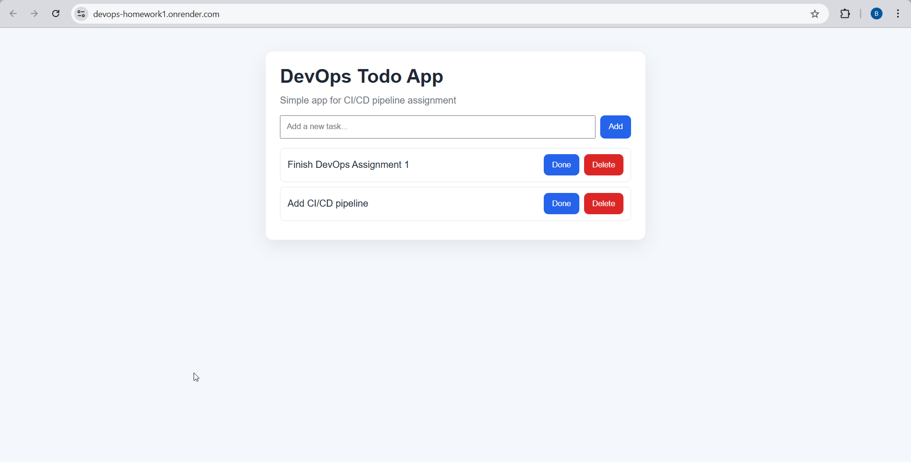
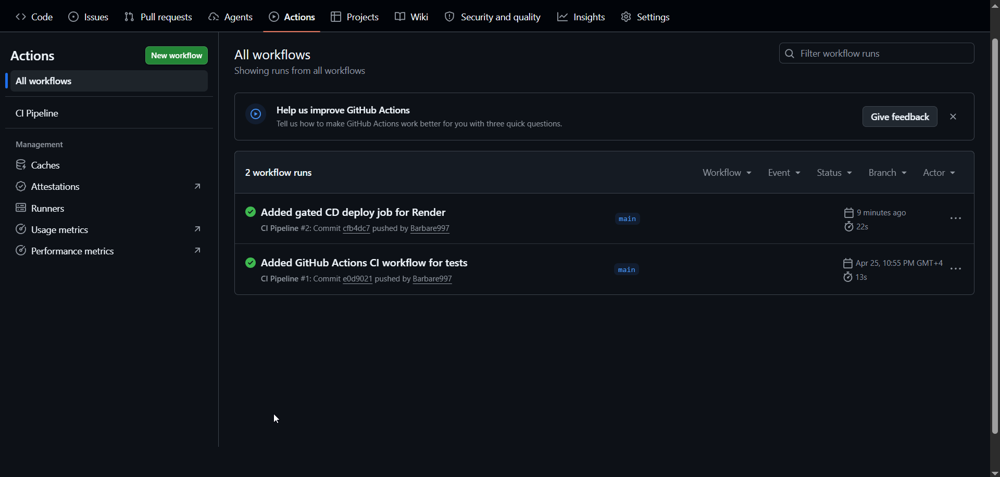
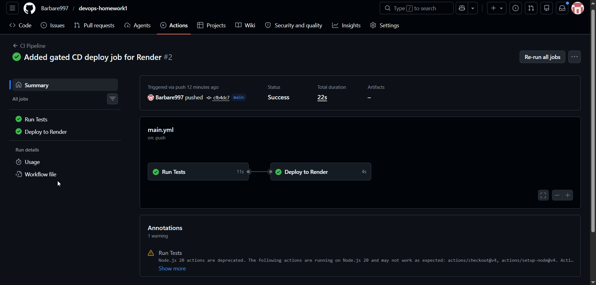
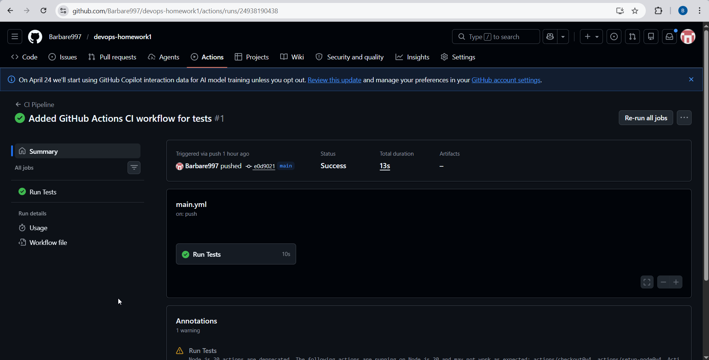

# Assignment 1 - CI/CD Pipeline Automation & Deployment Strategies

This repository contains a simple Todo web app used to demonstrate a complete CI/CD workflow:

- code push to GitHub
- automated testing with GitHub Actions
- automated deployment to Render only if tests pass

The app itself is intentionally simple. The main focus of this assignment is delivery automation and release safety.

## Live Application

- Live URL: [DevOps Todo App](https://devops-homework1.onrender.com/)

## Screenshots

### Hosted Application



### Successful GitHub Actions Run



### Workflow Jobs Success (Tests and Deploy)



### CI Test Job Success (Initial Run)



## Project Stack

- Node.js
- Express
- Jest + Supertest
- HTML/CSS/JavaScript
- GitHub Actions (CI/CD)
- Render (hosting)

## Repository Structure

```
.
├── .github/
│   └── workflows/
│       └── main.yml
├── public/
│   ├── app.js
│   ├── index.html
│   └── styles.css
├── src/
│   ├── app.js
│   └── server.js
├── tests/
│   └── app.test.js
└── package.json
```

## Pipeline Description (CI/CD Flow)

The project uses one GitHub Actions workflow: `.github/workflows/main.yml`.

1. On every `push` and `pull_request`, the pipeline runs:
   - `npm ci`
   - `npm test`
2. If tests fail, the workflow fails and deployment is not triggered.
3. If tests pass on `main`, a deploy job runs.
4. The deploy job calls Render Deploy Hook (`RENDER_DEPLOY_HOOK_URL`) to trigger production deployment.

This creates a quality gate where only tested code can reach production.

## Deployment Strategy

### Chosen Strategy: Recreate (Render Free Tier Friendly)

For this project, I used a **Recreate-style deployment** approach, which fits Render's free-tier setup well.

How it works here:

1. New code is pushed to `main`.
2. CI runs tests in GitHub Actions.
3. If CI is green, Render deploy is triggered.
4. The app is rebuilt and restarted with the new version.

Why this strategy was chosen:

- simple and reliable for a student project
- no extra infrastructure required
- fully automated and easy to explain/debug

## Rollback Guide (Render)

If a bug is found in production, rollback can be done in either of these ways.

### Option A: Roll back from Render Dashboard

1. Open Render service dashboard.
2. Go to deployment history.
3. Select the last stable deploy.
4. Redeploy that version.
5. Verify the live URL is healthy.

### Option B: Roll back from GitHub

1. Revert the problematic commit locally or on GitHub.
2. Push the revert commit to `main`.
3. CI runs again.
4. If tests pass, deployment is triggered automatically.
5. Confirm production behavior on the live URL.

## How to Run Locally

```bash
npm install
npm start
```

Open `http://localhost:3000`.

## How to Run Tests Locally

```bash
npm test
```
